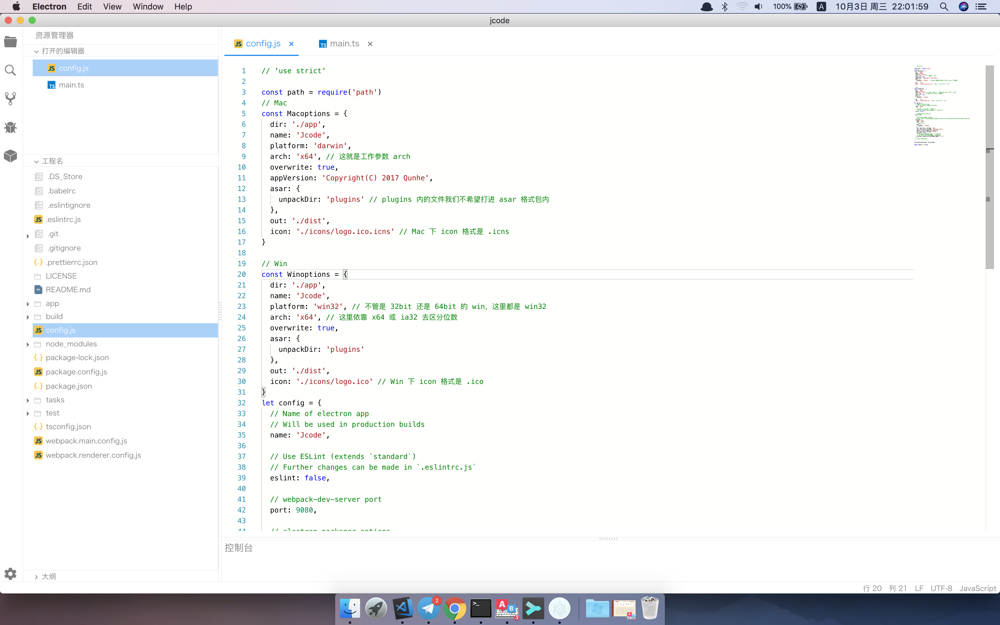
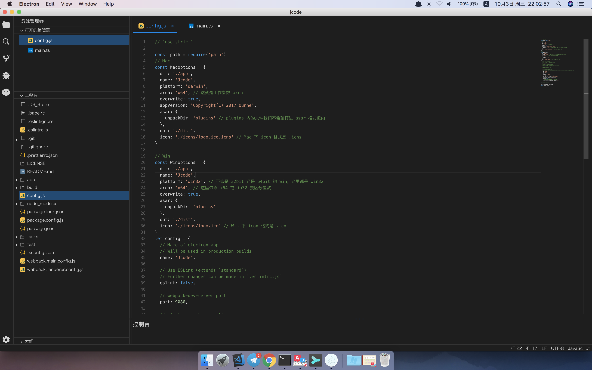

## 基于vue-electron的vs-code代码模拟器
项目模拟vs-code代码编辑器实现了打开文件，修改主题，国际化，修改，保存等功能
### 项目由来

项目整体建构借鉴了[k-water](https://github.com/k-water/electron-filesystem)作者写的**WIndows平台的文件管理器**
项目使用了typescript + vue + Vue-Electron技术进行开发

### 什么是Electron
Electron 可以让你使用纯 JavaScript 调用丰富的原生 APIs 来创造桌面应用。你可以把它看作是专注于桌面应用而不是 web 服务器的，io.js 的一个变体。

这不意味着 Electron 是绑定了 GUI 库的 JavaScript。相反，Electron 使用 web 页面作为它的 GUI，所以你能把它看作成一个被 JavaScript 控制的，精简版的 Chromium 浏览器。


以下资料供参考学习：

[Electron(维基百科)](https://zh.wikipedia.org/wiki/Electron_(%E8%BD%AF%E4%BB%B6%E6%A1%86%E6%9E%B6))

[中文文档](https://www.w3cschool.cn/electronmanual/)

[(译)Electron的本质](https://segmentfault.com/a/1190000007503495)


[入门视频教程](http://ourcodeworld.com/articles/read/106/how-to-choose-read-save-delete-or-create-a-file-with-electron-framework)

### 技术栈
* [x] Vue
* [x] TypeScript
* [x] VueRouter
* [x] Vuex
* [x] Vue-Electron
* [x] iView
* [x] Eslint
* [x] Babel
* [x] Webpack
* [x] Less

项目采用了基于vue和electron的脚手架搭建开发环境

项目名称：`electron-vue`

项目地址：[https://github.com/SimulatedGREG/electron-vue](https://github.com/SimulatedGREG/electron-vue)

项目文档(英文的)：[https://simulatedgreg.gitbooks.io/electron-vue/content/en/](https://simulatedgreg.gitbooks.io/electron-vue/content/en/)

> PS：在开始编码之前要仔细阅读文档。

### 工程目录
``` bash
│
├── README.md                           <=  项目介绍
├── app                                 <=  开发目录
│   ├── dist                            <= 编译打包
│   ├── icons                           <= 相关图标
│   ├── src                             <= 项目源代码
│   │   ├── main                        <= electron主进程
│   │   │   ├── application.js
│   │   │   ├── index.dev.js
│   │   │   ├── index.js
│   │   ├── renderer                    <= electron渲染进程
│   │   │   ├── App.vue                 <=  Vue 根组件
│   │   │   ├── main.js                 <=  Vue 入口
│   │   │   ├── assets                  <=  静态资源
│   │   │   ├── common                  <=  公共配置
│   │   │   ├── config                  <=  项目配置
│   │   │   ├── extend                  <=  Vue 扩展相关
│   │   │   ├── router                  <=  Vue 路由相关
│   │   │   ├── store                   <=  Vuex
│   │   │   ├── views                   <=  视图层
│   ├── index.ejs                       <= 模板文件
│   ├── package.json                    <=  相关依赖
├── build                               <=  打包桌面应用相关
│   ├── Gruntfile.js                    <=  构建脚本
│   ├── package.json                    <=  相关依赖
├── tasks                               <=  electron-packeger打包
│   ├── release.js
│   ├── runner.js
├── test                                <=  测试文件夹  
│   ├── e2e
│   ├── unit
│   ├── .eslintrc
├── config.js                           <=  electron打包配置
├── webpack.main.config.js
├── webpack.renderer.config.js
├── package.js
│
│
```

### 使用说明

``` bash
# install dependencies
npm install

# serve with hot reload at localhost:9080
npm run dev

# build electron app for production
npm run build

# lint all JS/Vue component files in `app/src`
npm run lint

# run webpack in production
npm run pack

### login
username：admin
password：admin
```
---

### 效果预览





